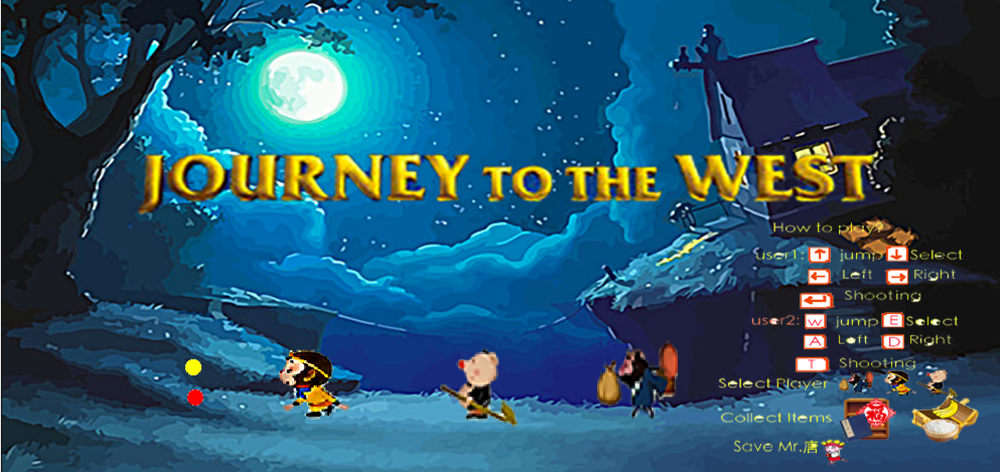

## Journey to the West
 * **Developer**
   * Yuyang Chen, Zhong Wang, Chenyan Yu, Wenyu Xiao, Yiwen Xiao
 * **Engine: Greenfoot 3.1.0**
 * **Game Background**
   * The background story of this game is a Chinese mythological novels，Mr.tang and his three apprentices travel from country Tang to Western world,during which they need to beat enemies and Mr.tang is always caught by enemies and three apprentices need to rescue Mr.tang. Our players need to choose 2 roles in the first scenario before the game starts .     
   * Select Players
     
   * Play the Game
     
 * **Pattern used in this Game**
   * Factory √
   * Strategy √
   * State √
   * Adapter √
   * Singleton √
   * Composite √
   * Prototype √
 * **How to play**
   * Option 1: java -jar JourneyTotheWest.jar
   * Option 2: visit this link :http://www.greenfoot.org/scenarios/21143
   * Option 3: install Greenfoot, then open this directory
